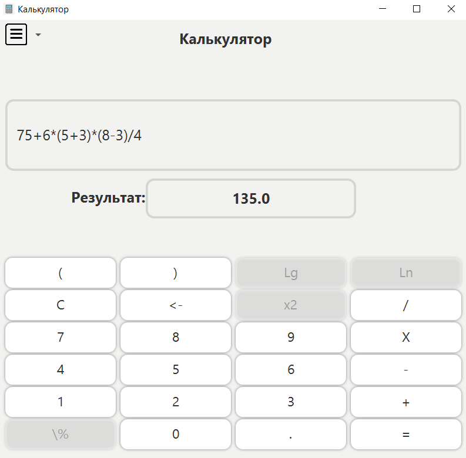
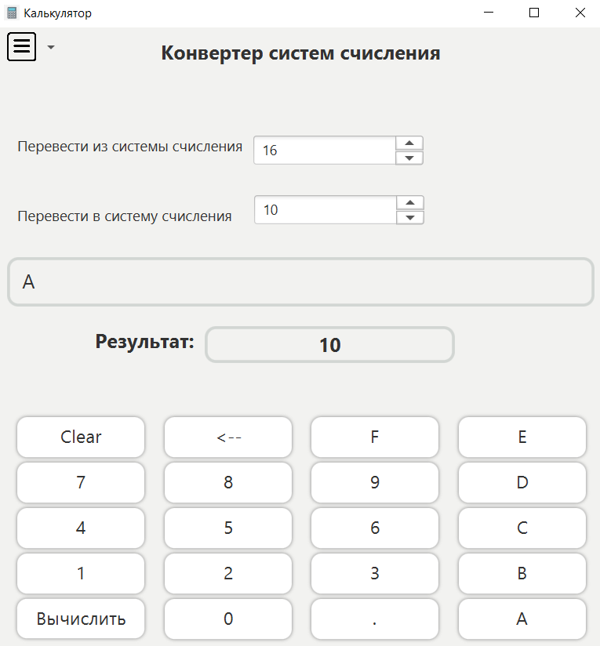
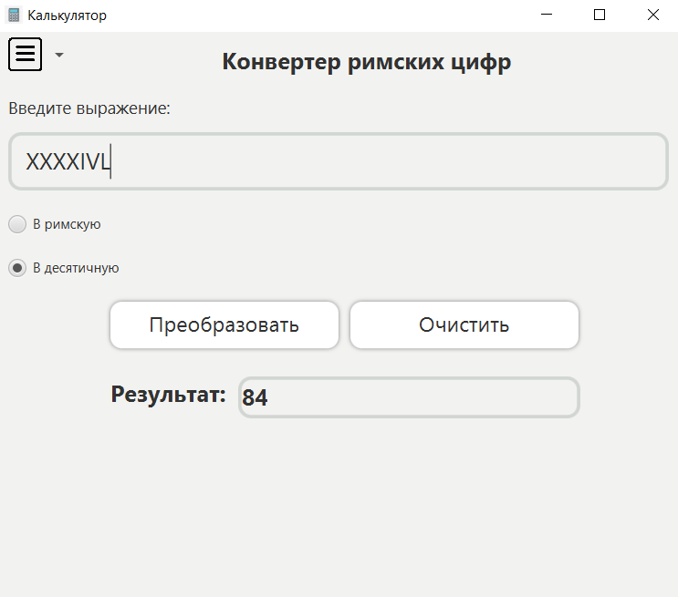
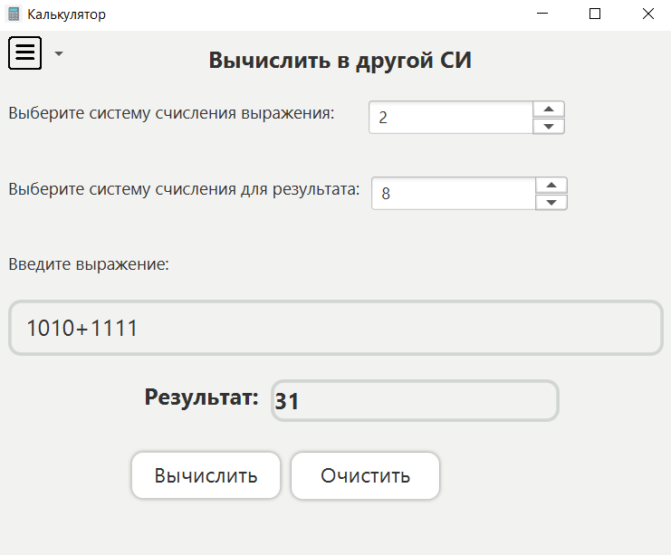

# Java-full-calculator

## Описание
Настольное Java приложение для вычисления выражений и конвертации систем счисления.

## Технологии и инструменты
* Java core
* Maven - управление зависимостями
* Git - контроль версий
* JavaFx - графический интерфейс
* Junit 5 - тестирование

## Цель
Самостоятельный учебный проект для углубления знаний Java Core, Maven, Junit. 
Изучение библиотеки JavaFx.

## Функционал
Калькулятор позволяет получить значение строкового выражения, используя алгоритм
вычисления обратной польской нотации.
В калькуляторе поддерживается:
* Дробное представление
* Отрицательные числа
* Умножение / деление
* Сложение / вычитание
* Операции со скобками

 Также, реализовано вычисление выражений в любой системе счисления(СИ)
и получения ответа в заданной СИ.

Конвертер поддерживает перевод числа из любой системы счисления (до 26-ой) в любую (до 26-ой).
Доступна конвертация в римскую систему счисления и из римской системы в десятичную.

Реализован графический интерфейс.

## Запуск
1. Склонировать проект: git clone https://github.com/SergeyIv24/FullCalculator.git
2. Перейти в папку с проектом: cd FullCalculator
3. Запуск: mvn javafx:run

## Демонстрация функционала
Главное меню приложения:

Калькулятор (некоторые операции в работе):

Конвертер систем счисления:

Конвертер в римскую систему счисления:

Вычисление выражений в системах счисления:
